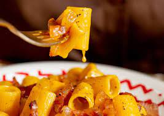

# Ricette: Mezze maniche[^1] Rigate alla Carbonara

## **Indice**
*Introduzione*
1. *Ingredienti della ricetta*
2. *Tempistiche di preparazione e difficolta*
3. *Procedimento*
4. *Link collegati*
   ***

#### Introduzione
Quando la più _famosa ricetta romana_ incontra la
pasta più autenticamente napoletana, è impossibile
resistere alla tentazione.
***

#### 1) Ingredienti da Utilizzare
- 400 g di Mezze Maniche Rigate
- Voiello n. 122
- 200 g Pecorino
- 5 tuorli d'uovo
- 280 g guanciale
- Pepe nero q.b.
***

#### 2) Tempistiche e difficolta
- Tempistca di cottura:
  * Per una cottura *al dente* : cuocere per circa 15 minuti
  * Per una cottura *media* : cuocere per circa 18 minuti
  * La cottura *perfetta* : cuocere per circa 20 minuti
- Quantita per persone:
  * Per 2 persone : circa 200 g
  * Per 4 persone : circa 350 g
  * Per più di 4 : adeguarsi in base ai condimenti
_Difficolta_ del piatto : *facile*
***

#### 3) Procedimento
- Eliminare la cotenna del guanciale, tagliare a
listarelle spesse circa mezzo centimetro. Lasciare
sfrigolare in una padella a fuoco moderato finché la
parte grassa diventa trasparente. Versare il grasso
in una ciotola e rimettere il guanciale sul fuoco per
renderlo croccante. Spegnere la fiamma e mettere
da parte il guanciale.

- In una scodella amalgamare brevemente con una
spatola i tuorli, unire il pepe e il pecorino
(tenendone da parte due cucchiai). Aggiungere 2
cucchiai di grasso del guanciale per rendere il
composto vellutato.

- Nel frattempo cuocere le Mezze Maniche Rigate
Voiello usando circa la metà del sale adoperato
abitualmente (il pecorino è piuttosto saporito).
Mettere da parte un po’ d’acqua di cottura e scolare
al dente.

- Versare le Mezze Maniche Rigate nella padella del
guanciale. Unire la crema di tuorli e pecorino
insieme a un mestolo scarso d’acqua di cottura.
Mescolare per amalgamare il tutto fino a
raggiungere una consistenza cremosa. Aggiungere
una spolverata di pecorino e servire.
***

#### 4) Link Correlati alla ricetta
In caso di inconvenienti si posso consultare questi link:

>[Altri consigli sulla preparazione](https://it.wikipedia.org/wiki/Pasta_alla_carbonara)
>
>[Altre ricette](https://www.voiello.it/ricette/)

[^1]: _Questa è la preparazione normale, ma preparate integrata con l'usanza tipica romana_
